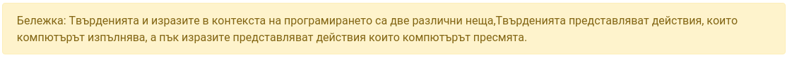
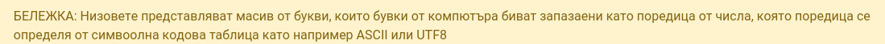

# Първи стъпки в JavaScript


#### Ключови думи
Ключовите думи, представляват думички, които компютърът използва
за създаването на валидни твърдения или така наречениете statements



*Основни* ключови думи в JavaScript

* [var](https://www.w3schools.com/js/js_variables.asp) - Ключова дума използвана за деклариране на промнелива

* [if](https://www.w3schools.com/js/js_comparisons.asp) - Ключова дума използвана за сравняване на данни

* [for](https://www.w3schools.com/js/js_loop_for.asp) - The web framework used

* [while](https://www.w3schools.com/js/js_loop_while.asp) - The web framework used

* [break](https://www.w3schools.com/js/js_break.asp) - The web framework used

* [function](https://www.w3schools.com/js/js_functions.asp) - The web framework used

## Основни типове данни

#### Числови

Числовите типове биват три вида:

* Реални числа точност до първа цифра (float) - 1.5, 2.6;
* Реални числа с точност до втора цифра (double)- 1.25, 1.45, 10.50;
* Цели числа (integers -> int);
    * Подписани цели числа:−2 147 483 648 до +2 147 483 647;
    * Неподписани цели числа: 4 294 967 296;
* символи - 'а', '/n'
* низът - сбор от символи
* булев тип - '1' = true или '0' = false

***
### Низов ([string](https://www.w3schools.com/js/js_strings.asp))
Низовият тип, репрезентира текст


####Примери
```
"Здравей Свята" - низ
'Аз се казвам Иван' - низ
```


***
## Масив

*Масивът, представлява много еднакви по тип променливи, които нямат собствени имена*

В програмирането, често се налага нужда от репрезентацията на много данни,
които имат някаква връзка помежду си.   


```
Give an example
```

